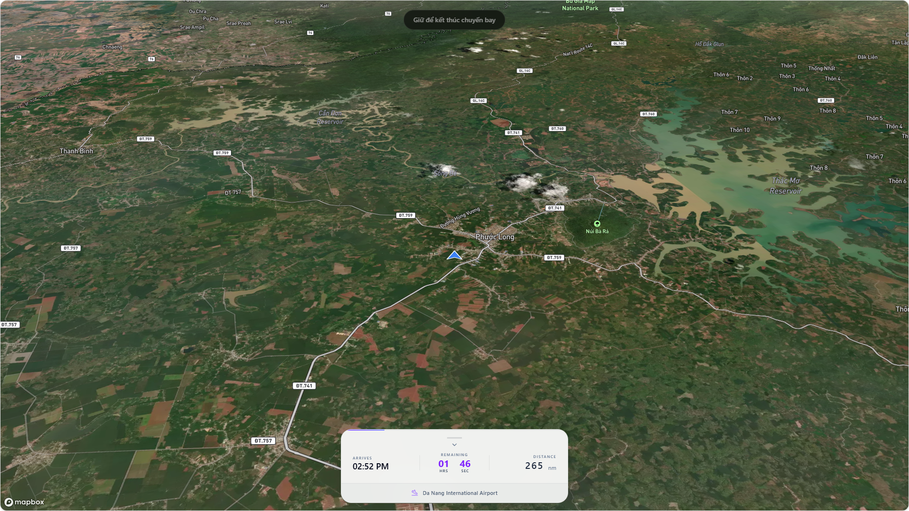
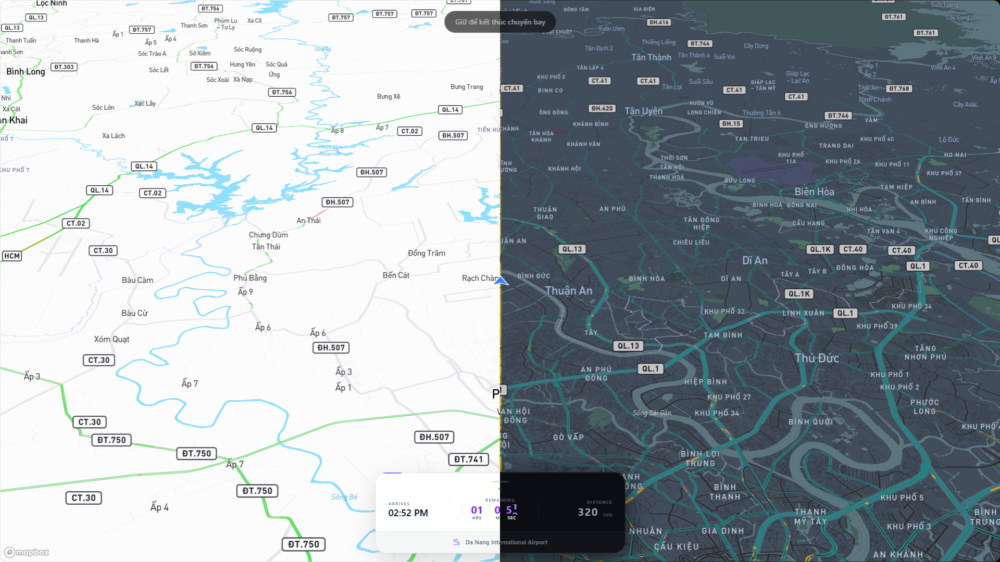

# FlightDeck

<p align="center">
	Another productivity app that turns a focus session into a departure board, a route map, and a boarding pass.
</p>

<p align="center">
	
	
	
	
</p>

## What It Is

Inspired by the FocusFlight app:
https://apps.apple.com/vn/app/focusflight-deepfocus-timer/id6648771147

FlightDeck reframes deep work as a flight.

You pick a departure airport, choose a destination, set a focus duration, select a seat, and let the app turn the rest of the session into a live in-flight experience. The result feels less like a timer and more like a ritual: route line, animated flight progress, boarding flow, and a printable ticket at the end.

## Preview

<table>
	<tr>
		<td width="50%">
			
		</td>
		<td width="50%">
			
		</td>
	</tr>
</table>

## Highlights

- Airport-to-airport focus sessions with a world map route.
- Printable boarding-pass style flow for starting a session.
- Live action bar showing remaining time, arrival estimate, and distance.
- Theme switching plus selectable map appearance and route accent color.
- Built-in localization for English, Vietnamese, and Japanese.
- Works without a Mapbox token by falling back to public map styles.


## Stack

- React 19
- TypeScript
- Vite
- Tailwind CSS 4
- Framer Motion
- Mapbox GL
- Turf.js
- i18next

## Setup Guide

### 1. Prerequisites

Install these first:

- Node.js 20 or newer
- npm 10 or newer

### 2. Install dependencies

```bash
npm install
```

### 3. Optional: add a Mapbox token

The app can run without a token. If you do nothing, it will use public fallback map styles.

If you want the full Mapbox style experience, create a `.env` file in the project root:

```bash
VITE_MAPBOX_ACCESS_TOKEN=your_mapbox_access_token_here
```

You can get a token from Mapbox:

- https://account.mapbox.com/

After adding the token, restart the dev server.

### 4. Start the app

```bash
npm run dev
```

Vite will print the local URL, usually:

```text
http://localhost:5173
```

### 5. Production build

```bash
npm run build
```

### 6. Preview the production build

```bash
npm run preview
```

### 7. Run linting

```bash
npm run lint
```

## Project Scripts

| Command | Purpose |
| --- | --- |
| `npm run dev` | Start the Vite development server |
| `npm run build` | Type-check and build the production bundle |
| `npm run preview` | Serve the production build locally |
| `npm run lint` | Run ESLint across the project |

## Airport Dataset

The project already ships with airport data in `public/airports.json`.

If you want to regenerate it from the source CSV, or update new data, run:

```bash
python create_dataset.py
```

What the script does:

- Downloads `airports.csv` if it is missing.
- Filters the dataset to airports with valid IATA and ICAO identifiers.
- Writes the trimmed result to `public/airports.json`.

This step is optional for normal development.

## App Flow

1. Open the booking screen.
2. Select a departure airport.
3. Select an arrival airport.
4. Choose a focus duration.
5. Pick a seat.
6. Print the boarding pass.
7. Start the session and follow the route until arrival.

## Localization

Currently included:

- English
- Vietnamese
- Japanese

Translations live in `src/locales` and are wired through `src/i18n.ts`.

## Folder Notes

- `src/components` contains the app screens and UI building blocks.
- `src/components/ui/map` contains the reusable map primitives.
- `src/locales` contains translation files.
- `public/assets/preview/themes` contains README preview images.
- `create_dataset.py` refreshes airport data.

## Roadmap Ideas

- [ ] Persist focus history and completed flights.
- [ ] Export completed session summaries.
- [ ] Add richer notification and sound behavior.

## License

No license is defined yet.
